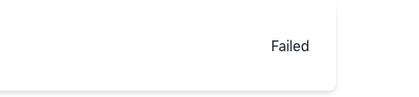

There are also some features that are not written in the front end because it is a rather basic front end. However, you can use the front-end functionality that is not yet available at https://polkadot.js.org/apps.

Also to use the front end you need to have a polkadot{.js} extension, download and install it [here](https://chrome.google.com/webstore/detail/polkadot%7Bjs%7D-extension/mopnmbcafieddcagagdcbnhejhlodfdd).

When you open the app you can see a page like this.


### Create and Sell/Buy

Now, connect your wallet and let's create your first NFT!

Click on the Create link on the Navbar and we will be taken to the Create page.


Because this is the first time you have created an NFT, click on "Have no collection? Click here to create", and you will open a Modal.


Fill them in, then create a collection.


Once created, you will need to wait a while to refresh the page. Of course, you don't have to refresh if things go well, but it's a good idea to do so.

Because you need to wait until the created collection is stored in the Query, you will need to wait a while to refresh the page once it has been created. Of course, if things go well, you don't have to refresh, but it's a good idea to do so.

Now, you can see new collection on here:


Select it and fill in the NFT information.

If you want to mint NFT in batch, fill in the number of items you want to mint in the Number of items section.


Once completed, click on the Mint button to mint NFTs.

After waiting for the Query to deposit the relevant data, click on the header image on the navigation bar to access the Profile. Then you can see the NFTs just minted.


If you want to sell, transfer or burn NFT, click on NFT Card in the Profile and you will see a Modal. These operations can be done here.


If you sell your NFT, you will find it on the home page.


By clicking on Card, you can see the details of NFT and of course you can choose to buy it. After clicking on the BUY button, enter the quantity you want to buy, and then you can buy it.


Then you can see it on your profile:


### Split NFT

Now let's separate NFT, select Create under Split.


Then select the Collection where the NFT to be separated is located and fill in the startIdx.


After this is done, a SubCollection will be created.

Then click split navigation:


We can now split this NFT.


Then, you can find the subTokens in the profile.

If you want to split NFT to FTs, Then you need to use polkadot  js app.

Click Extrinsics, and select subModule and create method.


Fill you NFT information and turn is_fungible to yes


after submit transaction, it will create a subCollection.

Find your subCollection at recent events.

Now, we need to use mintFungible method now. 


The receiver can be yourself or another account, which will receive the casting FTs.

If you want to get back you NFT, you can use recover method.


Fill your sub_token_collection_id, and submit it.

Before you do this you need to make sure you own all the NFTs or FTs in the collection, after recover, the Tokens in the subCollection will be destroyed and your NFT will be returned.

If you want to use bonding curve auction, let's select exchangeModule and createSemiTokenPool.


You can find the meaning of these parameters in the [documentation](https://starry-network.github.io/starry_node/pallet_exchange/enum.Call.html) 

Then you can use buySemiToken to buy some FTs.


### Graph Token

You can link a NFT to another one.


Remember, linking NFT to Father NFT or, NFT is owned by the root owner of Father NFT.

### DAO

To summon a DAO, just click summon and fill these information.


You can find an explanation of these parameters [here](https://starry-network.github.io/starry_node/pallet_nftdao/enum.Call.html)

Then you can find it on explore.


After summon DAO, remember to convert 1unit to the dao's accountId and escrowId to prevent these two accounts from not working properly.

You can get both accounts at polkadot js app or Query playground.

Open Query playground, then query these account:

```
{
  daos {
    nodes {
      id
      summoner
      escrowId
    }
  }
}
```


Let's make a new proposal after entering the DAO.


After click New Proposal button, we can get a new modal:


Fill them, and find their explanation in the [documentation](https://starry-network.github.io/starry_node/pallet_nftdao/enum.Call.html)

If you want to add a action to proposal, you need get encode call hash at polkadot js app, like this

 


Let's make a useless proposal:


After the Query has stored this data, remember to refresh the page.


A sponsored proposal is only valid if it is sponsored, so click on the sponsor button.

After successful sponsorship, wait for the data to be deposited by Query, then refresh the page.


You can vote at the end of this time. However, this time may not be accurate due to the delay.


After clike vote, you can choose yes or no.


The number of votes will be updated when it is refreshed.


After the voting period comes the Grace period. You can choose ragequit in the Grace period.

Just in Polkadot js app and fill them. Of course, you can't vote yes if you want ragequit.


After Grace period passed, rember to process proposal. Click process button:


After refreshing, if it shows success or failure:

